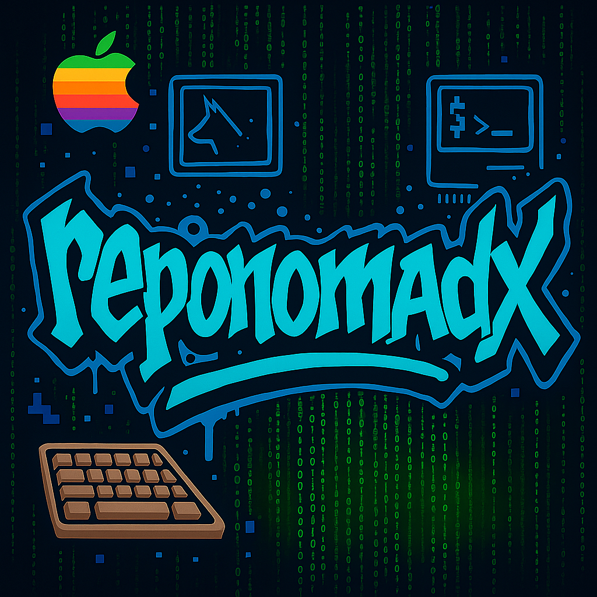

<p align="center">
  
</p>

<h1 align="center">Imprivata Failed Device Monitor</h1>

<p align="center">
  
  
  
  
  
</p>

---

## 📝 Overview

The **Imprivata Failed Device Monitor** is a macOS-based automation script that checks the real-time status of iPhones managed through Imprivata GroundControl. It tracks key checkout states — `Checked In`, `Checked Out`, `Overdue`, and `Failed`.

When failed devices are detected, the script can automatically reboot them via the Workspace ONE API (if the number is below a safe threshold).

---

## 🚀 Features

- Queries GroundControl API for all iOS devices
- Tracks and categorizes device checkout status
- Displays status counts and lists serials of failed/overdue devices
- Automatically reboots failed devices via Workspace ONE (optional, safe-guarded)
- Native macOS sound + dialog alerts (when interactive)
- Designed for background execution via LaunchAgent (every 4 hours)

---

## 📦 Dependencies

- macOS (tested on Monterey and later)
- `jq` command-line utility  
  Install via Homebrew:
  ```bash
  brew install jq
  ```

---

## 🔐 Credentials and Security

This script uses both:
- A GroundControl API Key (URL param)
- Workspace ONE OAuth credentials (Client ID + Secret)

> **⚠️ Important:** This script should be stored and executed on a secure, trusted machine.  
> If deploying more broadly, use an external secrets manager or `.env` file to handle credentials securely and avoid hardcoding secrets directly into the script.

---

## ⚙️ Setup (LaunchAgent)

To run the monitor automatically every 4 hours:

1. Copy the sanitized LaunchAgent to your Mac:
   ```bash
   ~/Library/LaunchAgents/com.imprivata.groundcontroldevicemonitor.plist
   ```

2. Load the LaunchAgent:
   ```bash
   launchctl load ~/Library/LaunchAgents/com.imprivata.groundcontroldevicemonitor.plist
   ```

3. Verify it's loaded:
   ```bash
   launchctl list | grep groundcontroldevicemonitor
   ```

4. Logs are saved to:
   - Standard Output:  
     `/Users/yourusername/scripts/Imprivata_FailedDevice_Monitor/Imprivata_FailedDevice_Monitor.out`
   - Standard Error:  
     `/Users/yourusername/scripts/Imprivata_FailedDevice_Monitor/Imprivata_FailedDevice_Monitor.err`

---

## 📁 File Structure

```
Imprivata_FailedDevice_Monitor/
├── Imprivata_FailedDevice_Monitor.sh             # Main script
├── com.imprivata.groundcontroldevicemonitor.plist # LaunchAgent for scheduling
├── reponomadx-logo.jpg                           # Logo
```

---

## ✍️ Author

**Brian Irish**  
GitHub: [@brianirish](https://github.com/brianirish)

---

## 📄 License

This project is licensed under the [MIT License](LICENSE).

---

## 💬 Feedback

Feel free to open issues, suggest improvements, or fork the project if you’d like to contribute.  
This script was built for real-world enterprise use — hope it helps others streamline GroundControl workflows just like it did for us.
